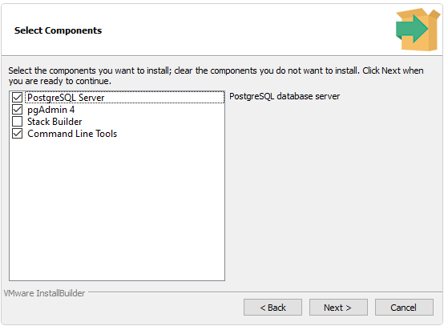

# MultimediaCentre

## Requirements (to install)
- Postgres

## Install Postgres
Download Postgres [here](https://www.postgresql.org/download/), during the intallation process you will be able to install pgAdmin. While you want to install pgAdmin, you don't need to install Stack Builder.

## Contributers
ToDo