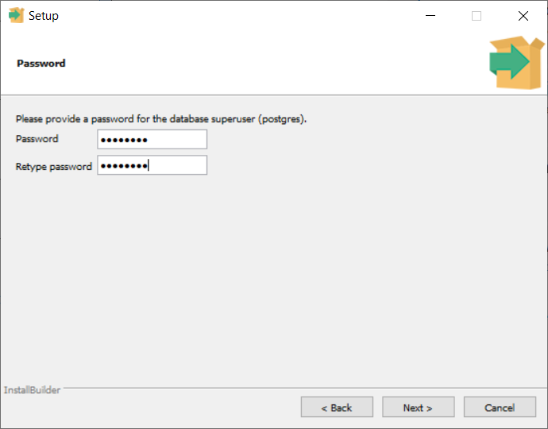

# MultimediaCentre

## Requirements (to install)
- Postgres

## Installing Postgres
Download Postgres [here](https://www.postgresql.org/download/), during the intallation process you will be able to install pgAdmin. While you want to install pgAdmin, you don't need to install Stack Builder.
   
The Password must be the same as in ./Database-SQL/DbSettings.cs
   

## Contributers
- Jeremia Ott - jeremia.ott@edu.fh-johanneum.at